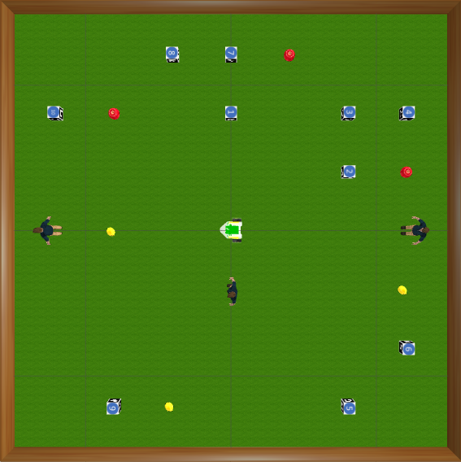

# You Pass Fruit

Group project for ECE4078-Intelligent Robotics, using the [PenguinPi robot](https://cirrusrobotics.com.au/products/penguinpi/) in the [Gazebo simulator](http://gazebosim.org/) to move lemons away from people and deliver apples to people while avoiding ARUCO markers.

**Tasks**:

- Detect ARUCO markers in the camera frame using OpenCV.
- Detect apples, lemons and people in the camera frame using trained YOLOv5s model.
- Use object heights and estimated robot orientation to triangulate an estimated position of the objects in the world.
- Use SLAM and EKF to continuously update the map and localisation of the robot within it.
- Use path planning algorithms (RRT) and proportional control to navigate the robot in the world.

**Initial mapping of the environment:**

**Aerial view of the gazebo simulator world:**

**Navigation with RRT:**

Click [here](https://github.com/tianleimin/ECE4078_Lab_2021/blob/main/Week01-02/InstallationGuide.md) for VM and simulator environment installation instructions and [here](https://github.com/tianleimin/ECE4078_Lab_2021/) for more details on the project guidelines.